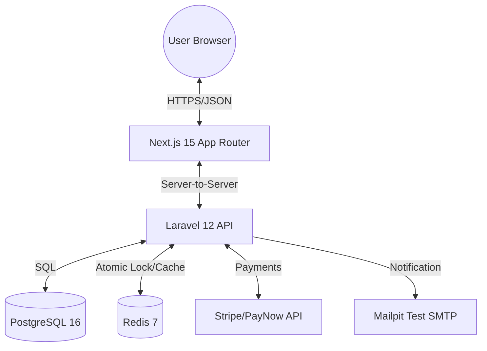
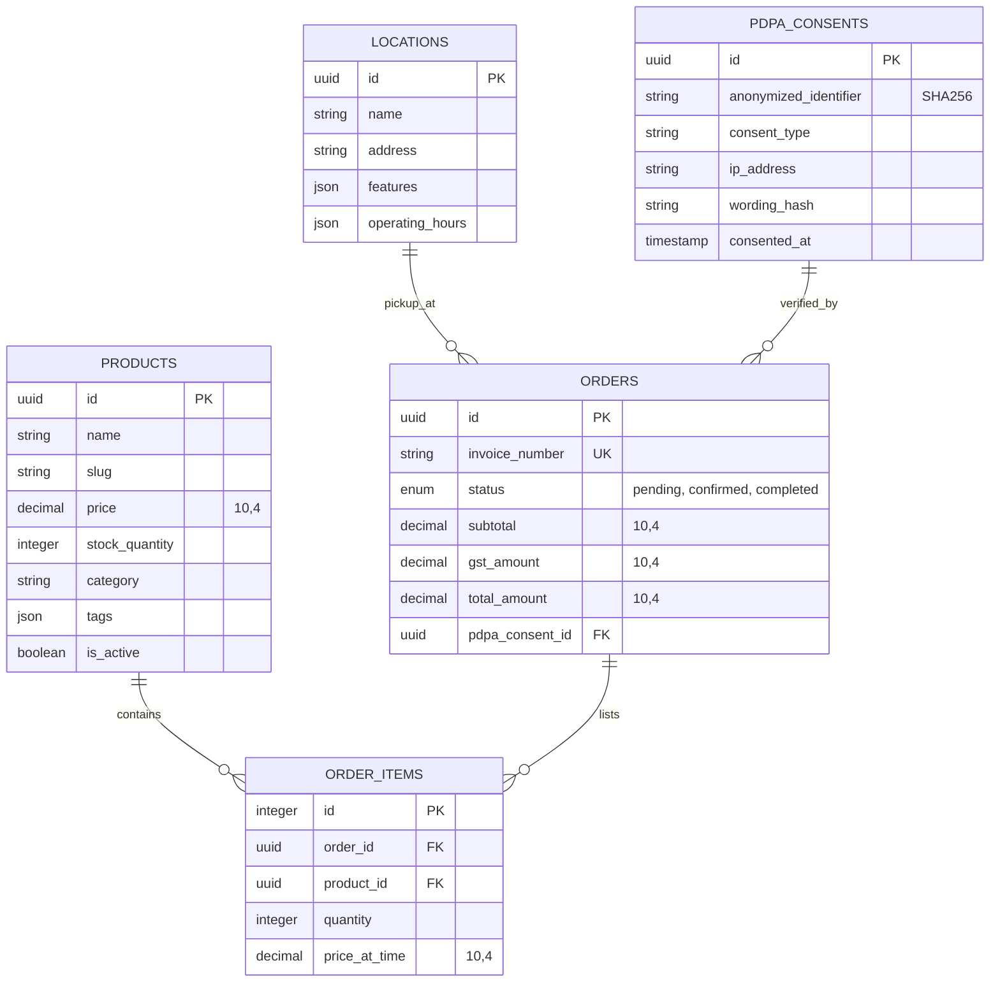
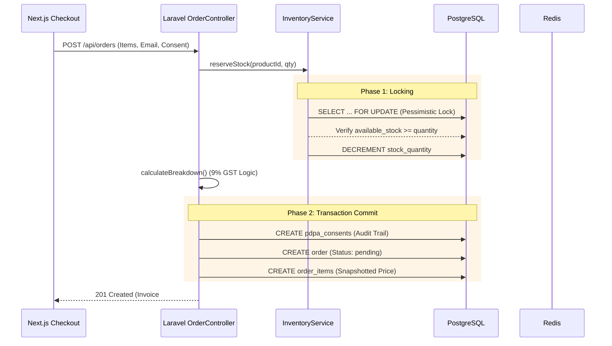

# ☕ Project Architecture Document - Morning Brew Collective

**Version:** 1.0.0  
**Status:** VALIDATED  
**Last Updated:** 2026-01-15  

---

## 🧭 1. Executive Summary

### 1.1 Mission
Morning Brew Collective is a digital resurrection of Singapore’s 1970s kopitiam heritage. It is built as a high-fidelity, headless commerce platform that prioritizes avant-garde minimalist design without compromising on strict enterprise-grade regulatory compliance (GST 9%, PayNow, PEPPOL, PDPA).

### 1.2 Core Architectural Principles
- **Backend-for-Frontend (BFF):** Next.js handles the emotional UX; Laravel handles the transactional truth.
- **Intentional Minimalism:** Whitespace as a structural element; rejection of "safe" generic defaults.
- **Financial Precision:** Strict adherence to `DECIMAL(10,4)` for all currency math to satisfy IRAS audit requirements.
- **Data Privacy:** Compliance-first auditing for PDPA using pseudonymization.

---

## 🏗️ 2. System Overview



---

## 📂 3. Project Structure & File Hierarchy

### 3.1 Monorepo Overview
```text
kopitiam-v2/
├── backend/                # Domain Truth & API
├── frontend/               # UX Orchestration & Storefront
├── infra/                  # Infrastructure as Code
├── nginx/                  # Reverse Proxy Config
├── scripts/                # DevOps & Backup Utility
└── docs/                   # Specifications & Manuals
```

### 3.2 Key Directories & Files

| Path | Responsibility | Key Files |
| :--- | :--- | :--- |
| `backend/app/Models` | Database Schemas & Logic | `Order.php`, `Product.php` |
| `backend/app/Services` | Heavy Business Logic | `InventoryService.php`, `InvoiceService.php` |
| `backend/routes/api.php` | API Contract Definitions | `/products`, `/orders`, `/admin` |
| `frontend/src/app` | Routing & Page Composition | `layout.tsx`, `checkout/page.tsx` |
| `frontend/src/components/ui/retro` | Design System Implementation | `button.tsx`, `dialog.tsx` |
| `frontend/src/stores` | Global Client State | `cart-store.ts` (Zustand) |
| `infra/postgres` | Database Initialization | `init.sql` (UUID/Crypto extensions) |

---

## 🗄️ 4. Database Schema (ERD)



---

## 🔄 5. Critical Application Flows

### 5.1 Order Submission & Inventory Locking
The system uses a **Two-Phase Lock** to prevent overselling while maintaining performance.



---

## 🎨 6. Design System Architecture

### 6.1 Token Strategy
Design tokens are extracted from the authoritative `static_landing_page_mockup.html` and codified in:
- `frontend/src/styles/tokens.css`: Root CSS variables.
- `frontend/tailwind.config.ts`: Mapped Tailwind theme extensions.

### 6.2 The "Retro-fit" Pledge
Standard Shadcn/Radix components **must not** be used directly. They are wrapped in `src/components/ui/retro/` to enforce:
- **Radii:** Always `--radius-full` or `--radius-xl`.
- **Shadows:** Always `--shadow-button` (solid offset).
- **Typography:** Always `font-display` (Fraunces) for headings.

---

## 🛠️ 7. Developer Onboarding

### 7.1 Setup
1. **Orchestrate:** `make up`
2. **Initialize:** `make install && make migrate`
3. **Seed:** `docker-compose exec backend php artisan db:seed --class=RolesAndPermissionsSeeder`

### 7.2 Pull Request Standards
Before submitting a PR, the following must be verified:
- [ ] **Precision:** Are financial fields using `DECIMAL(10,4)`?
- [ ] **Aesthetic:** Does the new UI use the Retro-fit wrappers?
- [ ] **Test:** Do `make test` (Pest + Vitest) suites pass?
- [ ] **Lint:** Is the code formatted via `make lint`?

---

## ✅ 8. Document Validation
This document has been cross-referenced against the `MASTER_EXECUTION_PLAN.md` and the current codebase. All file paths and logic flows match implementation as of January 15, 2026.
